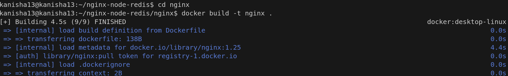
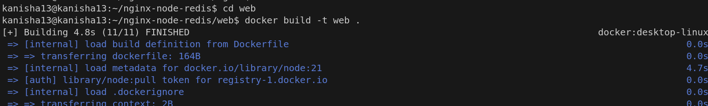
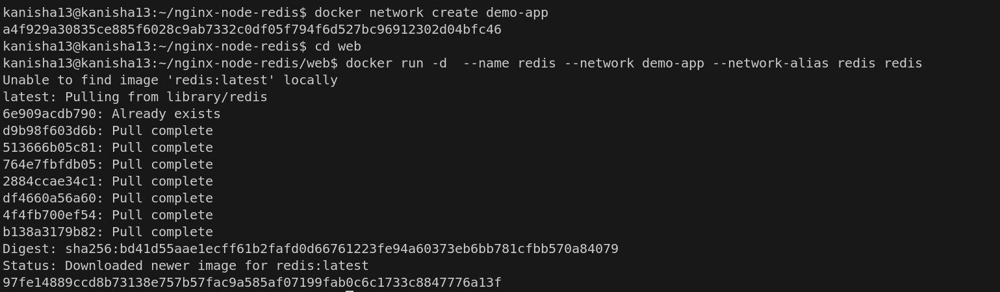
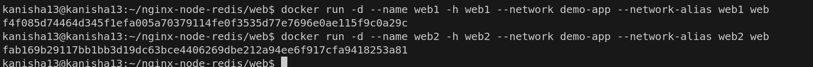
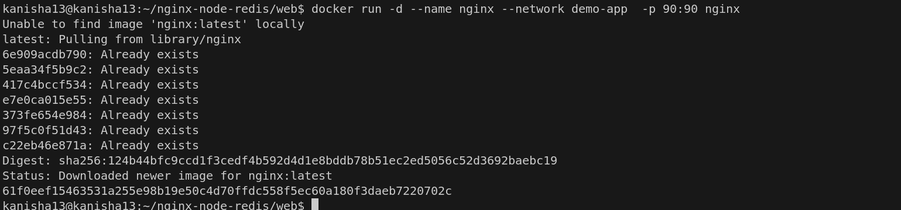
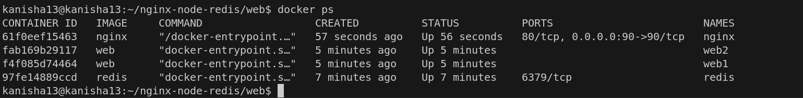
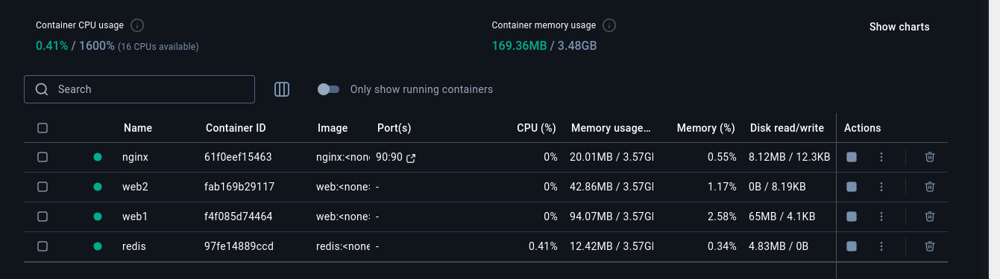
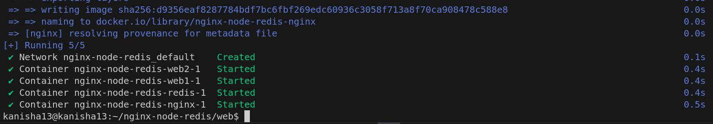
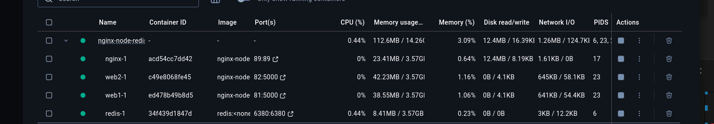

# Multi-Container Applications with Docker

## Introduction

Multi-container applications allow developers to split complex applications into smaller, specialized services that work together.

### What Are Multi-Container Applications?
Multi-container applications divide functionality across multiple containers, each handling a specific part of the application. This approach:

- Promotes separation of concerns
- Increases modularity
- Improves maintainability
- Enhances scalability

## Build the images 
build two images into each of their directories





## Run the containers 

- redis 



- web 1 and 2 



- nginx - while running nginx change the ports from 8080 to 9090 since it will already be in use.



Now to see if the containers are up and running, execute the command 

``` docker ps ```



In docker desktop



## Simplify the deployment using Docker Compose

Using ```docker compose up``` run the application.



The containers are up and running.



## Conclusion

Multi-container applications represent a modern approach to application architecture, allowing developers to build more maintainable, scalable software. Docker Compose simplifies the process of defining, running, and managing these interconnected services